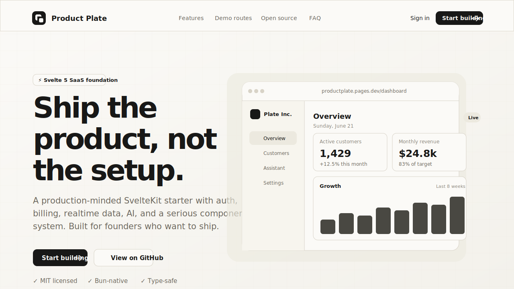

<p align="center">
  
</p>

<h1 align="center">Product Plate</h1>

<p align="center">
  <strong>Ship the product, not the setup.</strong>
</p>

<p align="center">
  An open-source SvelteKit SaaS starter with auth, billing, realtime data, AI patterns, and a polished product UI.
</p>

<p align="center">
  <a href="https://productplate.pages.dev">Live demo</a>
  ·
  <a href="https://github.com/rodrgds/productplate">GitHub</a>
  ·
  <a href="./LICENSE">MIT License</a>
</p>

<p align="center">
  
  
  
  
  
  
</p>

## What is Product Plate?

Product Plate is a production-minded SaaS starter for founders, indie hackers, and SvelteKit developers who do not want to rebuild the same foundation every time.

It gives you the boring but necessary parts of a real SaaS app: authentication, billing scaffolding, realtime backend functions, protected app routes, settings, onboarding, dashboard UI, AI assistant patterns, test setup, and deployment wiring.

It is not a locked-down framework. It is ordinary SvelteKit and Convex application code, designed to be forked, changed, deleted, and shaped into your own product.

## Why use it?

- **Open source and MIT licensed** - use it for personal, commercial, closed-source, or open-source projects.
- **Modern Svelte stack** - SvelteKit 2, Svelte 5, TypeScript, Tailwind CSS v4, and shadcn-svelte.
- **Real SaaS surfaces included** - dashboard, assistant, billing, settings, onboarding, editor, graph, and demo routes.
- **Backend already wired** - Convex functions, realtime data, storage, typed APIs, auth integration, and billing hooks.
- **AI-ready** - Vercel AI SDK streaming chat and tool patterns are included instead of left as an exercise.
- **Good developer experience** - Bun, Devenv, Vitest, Playwright, linting, typechecking, PWA setup, and Cloudflare Pages deployment.

## Preview

<p align="center">
  
</p>

Try the hosted demo at **[productplate.pages.dev](https://productplate.pages.dev)**.

## Included

### Core stack

- SvelteKit 2
- Svelte 5
- TypeScript
- Tailwind CSS v4
- shadcn-svelte
- Bun

### Backend and data

- Convex functions
- Realtime queries
- Typed APIs
- Convex storage
- Server-side auth helpers
- Protected app routes

### Product features

- Better Auth email/password flow
- OAuth hooks for providers like Google
- Password recovery scaffolding
- Autumn subscription and billing scaffolding
- AI assistant route and streaming chat patterns
- Dashboard, settings, billing, onboarding, editor, graph, and 3D demo routes
- PWA support

### UI and components

- shadcn-svelte primitives
- Marketing blocks adapted for Product Plate
- Product cards, forms, tables, overlays, navigation, charts, editor, and AI components
- Clean neutral design system that is easy to restyle

### Developer experience

- Bun-only package management
- Reproducible Devenv shell
- `devenv up` process setup for SvelteKit and Convex
- Vitest unit tests
- Playwright end-to-end tests
- ESLint, Prettier, and Svelte diagnostics
- Cloudflare Pages workflow

## Quick start

### Option 1: local tools

```sh
git clone https://github.com/rodrgds/productplate.git my-saas
cd my-saas
bun install
cp .env.example .env.local
```

Start Convex and SvelteKit in separate terminals:

```sh
bun convex dev
```

```sh
bun dev
```

Open **http://localhost:5173**.

### Option 2: Devenv

```sh
git clone https://github.com/rodrgds/productplate.git my-saas
cd my-saas
devenv shell
setup
devenv up
```

`setup` installs dependencies and creates `.env.local` if it does not exist. `devenv up` runs SvelteKit and Convex together.

## Environment

Copy `.env.example` to `.env.local` and fill in the services you use.

Required for local development:

```env
CONVEX_DEPLOYMENT=
PUBLIC_CONVEX_URL=
PUBLIC_CONVEX_SITE_URL=
SITE_URL=http://localhost:5173
BETTER_AUTH_SECRET=
```

Optional integrations:

```env
GOOGLE_CLIENT_ID=
GOOGLE_CLIENT_SECRET=
RESEND_API_KEY=
RESET_EMAIL_FROM=
RESET_EMAIL_REPLY_TO=
OPENROUTER_API_KEY=
AUTUMN_SECRET_KEY=
```

See `.env.example` and `.env.server.example` for the full setup.

## Commands

| Command | Purpose |
| --- | --- |
| `bun dev` | Start SvelteKit |
| `bun convex dev` | Start Convex |
| `bun run check` | Typecheck Svelte and TypeScript |
| `bun run lint` | Run Prettier and ESLint checks |
| `bun run test:unit` | Run Vitest |
| `bun run test:e2e` | Run Playwright |
| `bun run build` | Build for production |
| `bun run verify` | Run lint, check, tests, and build |

## Project map

```text
src/routes/                 SvelteKit routes and API handlers
src/routes/(app)/           Authenticated product routes
src/lib/components/ui/      shadcn-svelte primitives
src/lib/components/ai/      AI chat and tool components
src/lib/components/mist/    Adapted Svelte marketing blocks
src/convex/                 Convex schema, auth, billing, and functions
docs/                       Project-specific integration guidance
```

## Deployment

The default production path is Convex plus Cloudflare Pages. The live demo is deployed at **https://productplate.pages.dev**.

1. Deploy Convex:

   ```sh
   bun convex deploy
   ```

2. Configure production variables in Convex and Cloudflare.

3. Connect the repository to Cloudflare Pages or use the included workflow in `.github/workflows/cloudflare-pages.yml`.

Cloudflare Pages settings:

```text
Build command: bun run build
Build output: .svelte-kit/cloudflare
Node.js: 22
```

## Component sources

- Core primitives: [shadcn-svelte](https://www.shadcn-svelte.com/)
- Marketing block foundations: [Svelte Shadcn Blocks](https://sv-blocks.vercel.app/)
- AI interface patterns: [AI Elements](https://ai-sdk.dev/elements)

The imported marketing blocks are MIT licensed. Their structure and styling were adapted to the Product Plate design system and Svelte 5 conventions.

## Contributing

Contributions are welcome.

- Use Bun for package operations.
- Read `AGENTS.md` before editing Svelte or Convex code.
- Add focused tests for behavior changes.
- Run `bun run verify` before opening a pull request.

## License

Product Plate is released under the [MIT License](LICENSE).
